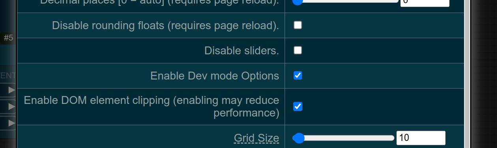
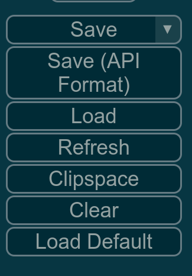

runpod-comfy-client
===================

A client for our [RunPod Comfy Worker](https://github.com/Infinishot/runpod-comfy-worker) with support for worfklow parameterization and asynchronous workflow execution.

Usage
-----

### Installation

After cloning, run:

```bash
pip install .
```

### Export ComfyUI workflow in API format

ComfyUI has two different workflow format. The _standard_ format for use with the frontend and a API format which corresponds to the actual execution graph that is send to the backend. Exporting workflows in API format has to be enabled in the developer settings first:



Afterwards, a separate button for API format export should appear below the normal "Save" button:



### Prepare workflow for use with runpod-comfy-client

ComfyUI workflows (in API format) are deterministic and stateless. To allow parameterization of workflows, we template them with the Jinja template engine.

To transform a workflow into a Jinja template, first append the `.jinja` suffix to the filename, e.g. `workflow.json` becomes `workflow.json.jinja`. The nodes for loading input images and supplying the empty latent image need to be templated to obtain their value from the `input_images_dir` and `batch_size` variables respectively. This should generally look like the following example:


```json
{
    "1": {
        "inputs": {
            "directory": "{{ input_images_dir }}",
            "image_load_cap": 0,
            "start_index": 0,
            "load_always": false
    },
    "class_type": "LoadImagesFromDir",
        "_meta": {
            "title": "Load Reference Images"
        }
    },
    "2": {
        "inputs": {
            "width": 896,
            "height": 1152,
            "batch_size": {{ batch_size|int }}
        },
    "class_type": "EmptyLatentImage",
        "_meta": {
            "title": "Empty Latent Image"
        }
    },
}
```

Additional variables can, of course, be used as well which then have to be passed to the workflow rendering function.

### Submitting a workflow to RunPod

The `RunpodComfyWorkflowExecutor` class provides functionality to submit a workflow template to RunPod and handle the results.

```python
from PIL import Image
import runpod
from runpod_comfy import RunpodComfyWorkflowExecutor, WorkflowTemplate

runpod.api_key = "<YOUR_RUNPOD_API_KEY>"

input_images = [Image.open(file) for file in ["image1.jpg", "image2.jpg"]]

workflow_template = WorkflowTemplate("workflow.json.jinja")

executor = RunpodComfyWorkflowExecutor(
    endpoint="<RUNPOD_ENDPOINT_ID>",
    batch_size=8
)

image_items = executor.submit_workflow(
    workflow_template=workflow_template,
    input_images=input_images,
    num_samples=16
)

for image_item in image_items:
    image_item.item.save(image_item.name)
```

A few notes on the example above:

* The executor can be configured to use a certain batch size. The value can also be overwritten by providing a `batch_size` to the `submit_workflow` method.
* A value for `num_samples` can be provided to generate approximately `num_samples / batch_size` batches within a single RunPod job. While multiple jobs could be submitted to achieve the same results, generating multiple batches within a single job will generally make better use of node results caching and thus improve efficiency and latency.
* The result is a list of `WorkflowOutputImage` objects. These provide the output image, the filename as set by ComfyUI and optionally the subfolder to which the image has been saved originally.

### Asynchronous workflow execution

Executing RunPod job can take a long time in some cases, for instance, if a container image needs to be pulled first or models need to be loaded. The `RunpodComfyWorkflowExecutor` class therefore provides the `submit_workflow_async` to execute workflow submissions asynchronously. The interface and behavior is the same as for the synchronous `submit_workflow` method, except that an awaitable `asyncio.Future` will be returned.

This feature can be used to run multiple jobs concurrently conveniently:

```python
import asyncio

futures = [
  executor.submit_workflow(
    workflow_template=workflow_template,
    input_images=input_images,
    num_samples=16
  )
  for input_images in [...]
]

results = asyncio.gather(*futures)
```